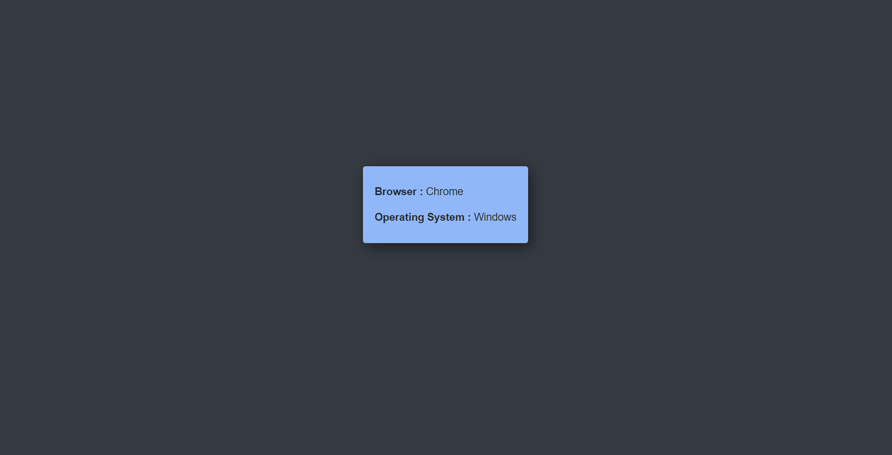

<html>
  

  <h1> BROWSER DETECTOR </h1>
  <h3> A JavaScript Website to detect Browser and OS of the Respective Device. </h3>
  

  

       
       
  

  

  <h3>Tap on this link to check it out: https://eshantrivedi21.github.io/Browser_Detection/</h3>
  

 </html>
